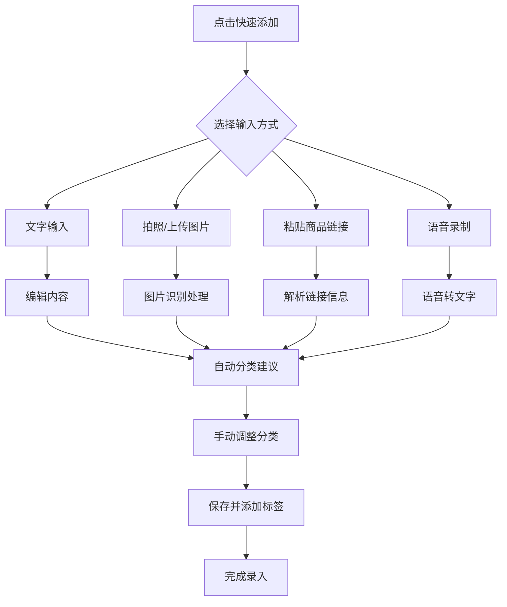
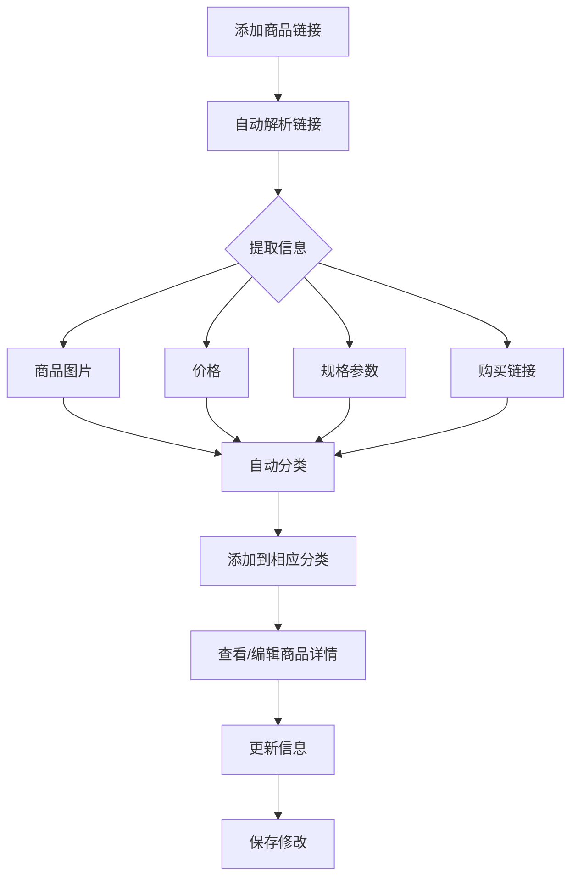
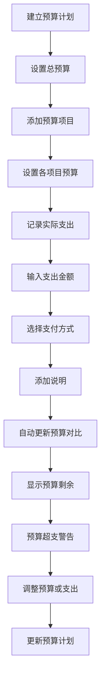

# 装修记事本应用设计方案

## 1. 整体架构与功能模块

### 1.1 应用架构
- 采用扁平化信息架构，减少层级跳转
- 核心功能：信息记录 → 分类整理 → 查找使用 → 分享协作
- 支持多端同步（移动端 + 桌面端）

### 1.2 功能模块

#### 1.2.1 首页（Dashboard）
- **待办事项列表**：显示装修进度中的待办任务
- **装修阶段进度**：可视化展示当前装修阶段
- **快速添加入口**：支持语音输入、图片识别、文字快速记录
- **热门商品推荐**：基于装修阶段的智能推荐

#### 1.2.2 分类管理
- **空间分类**：按房间分类（如客厅、卧室、厨房等）
- **材料分类**：按材料类型分类（瓷砖、地板、油漆等）
- **预算分类**：按费用项目分类（材料费、人工费、设计费等）
- **笔记分类**：按笔记类型分类（灵感、清单、合同、提醒等）

#### 1.2.3 信息录入
- **文字笔记**：支持富文本编辑
- **图片/视频**：拍摄或上传装修现场照片、设计图
- **商品链接**：自动解析电商链接，提取商品信息
- **语音记录**：支持语音转文字功能
- **手写记录**：提供手写笔记功能

#### 1.2.4 预算管理
- **预算规划**：建立详细的预算计划
- **实际支出**：记录每笔支出
- **预算对比**：实时显示预算剩余情况
- **费用统计**：可视化图表展示各类支出占比

#### 1.2.5 施工进度
- **进度跟踪**：记录每日施工进展
- **工序管理**：管理装修工序和时间表
- **验收记录**：记录各阶段验收结果

#### 1.2.6 工具与设置
- **单位换算工具**：长度、面积、体积、重量等换算
- **预算计算器**：快速计算材料用量和费用
- **设置中心**：应用参数配置
- **帮助中心**：使用指南和常见问题

## 2. 用户界面与交互流程

### 2.1 页面布局

#### 2.1.1 首页布局
```
┌─────────────────────────────────┐
│  🎨 装修记事本  🔍 搜索  + 新增  │  顶部导航栏
├─────────────────────────────────┤
│                                │
│  📋 待办事项 (3)                │  待办列表
│  • 购买瓷砖                      │
│  • 预约水电验收                  │
│  • 确认家具尺寸                  │
│                                │
├─────────────────────────────────┤
│  📊 装修阶段：水电改造 (45%)     │  进度展示
│  [=====     ]                   │
│                                │
├─────────────────────────────────┤
│  🖼️ 我的灵感墙                    │  快速访问
│  [图片网格]                     │
│                                │
├─────────────────────────────────┤
│  🔥 热门推荐                      │  商品推荐
│  [商品卡片1] [商品卡片2] [商品卡片3] │
│                                │
└─────────────────────────────────┘
```

#### 2.1.2 分类页面布局
```
┌─────────────────────────────────┐
│  🏠 空间分类  📦 材料分类 📝 笔记 │  分类导航
├─────────────────────────────────┤
│  [客厅] [卧室] [厨房] [卫生间]   │  空间标签
│                                │
├─────────────────────────────────┤
│  🛋️ 沙发 - ¥5,000               │  商品卡片
│  [图片]                         │
│  品牌：XXX · 规格：3.2m          │
│  [添加到购物清单] [查看详情]     │
│                                │
├─────────────────────────────────┤
│  📝 客厅布局灵感                  │  笔记卡片
│  [预览图]                       │
│  10条笔记 · 2天前更新           │
│                                │
└─────────────────────────────────┘
```

### 2.2 交互流程

#### 2.2.1 信息录入流程


#### 2.2.2 商品管理流程


#### 2.2.3 预算管理流程


## 3. 功能范围与优先级

### 3.1 核心功能（P0）
- 基础笔记功能（文字、图片、链接保存）
- 分类管理（按空间、材料、笔记类型分类）
- 预算管理（预算计划、支出记录、预算对比）
- 搜索功能（按关键词、标签、分类搜索）
- 数据同步（多端同步）
- 离线访问（本地存储）

### 3.2 重要功能（P1）
- 语音输入与识别
- 图片识别与文字提取
- 商品链接解析
- 施工进度管理
- 待办事项提醒
- 基础计算器与单位换算

### 3.3 高级功能（P2）
- 智能推荐系统
- 多用户协作
- 数据分析报告
- AR测量功能
- 3D设计预览
- 与其他工具集成（如CAD软件、电商平台）

### 3.4 优化功能（P3）
- 主题定制
- 数据导出功能
- 打印功能
- 更多语言支持
- 云存储扩展

## 4. 数据分类与存储结构

### 4.1 数据分类体系

#### 4.1.1 内容分类
- **装修笔记**：文字内容、图片、音频、视频
- **商品信息**：商品链接、价格、规格、购买渠道
- **预算数据**：预算计划、实际支出、发票信息
- **进度记录**：施工日志、验收报告、变更记录
- **待办事项**：任务内容、截止日期、优先级

#### 4.1.2 标签体系
- **空间标签**：客厅、卧室、厨房、卫生间、阳台
- **类型标签**：瓷砖、地板、油漆、家具、电器
- **状态标签**：待购买、已购买、待安装、已安装
- **价格标签**：高、中、低、预算内、超预算
- **品牌标签**：各类装修材料和家具品牌

### 4.2 数据存储结构

#### 4.2.1 用户数据结构
```json
{
  "userId": "123456",
  "profile": {
    "nickname": "装修达人",
    "phone": "13800138000",
    "avatar": "avatar_url"
  },
  "settings": {
    "theme": "light",
    "notifications": true,
    "autoSync": true
  },
  "装修项目": {
    "项目ID": "proj_001",
    "项目名称": "我的新家装修",
    "开工日期": "2026-04-01",
    "预计完工日期": "2026-10-01",
    "总预算": 200000,
    "实际支出": 120000,
    "装修阶段": "水电改造"
  }
}
```

#### 4.2.2 笔记数据结构
```json
{
  "笔记ID": "note_001",
  "项目ID": "proj_001",
  "标题": "客厅瓷砖选购笔记",
  "内容": "今天去建材市场看了几款瓷砖...",
  "分类": "材料笔记",
  "空间": "客厅",
  "标签": ["瓷砖", "预算内", "现代风格"],
  "创建时间": "2026-04-02T10:30:00Z",
  "更新时间": "2026-04-02T15:45:00Z",
  "多媒体": [
    {"类型": "图片", "URL": "image_url1"},
    {"类型": "链接", "URL": "product_link1", "标题": "某品牌瓷砖详情"}
  ]
}
```

#### 4.2.3 商品数据结构
```json
{
  "商品ID": "prod_001",
  "项目ID": "proj_001",
  "名称": "现代简约沙发",
  "价格": 4500,
  "链接": "product_url",
  "品牌": "XXX",
  "规格": "3.2m",
  "空间": "客厅",
  "分类": "家具",
  "标签": ["沙发", "现代风格", "预算内"],
  "状态": "待购买",
  "添加时间": "2026-04-02T11:00:00Z",
  "图片": "product_image_url",
  "购买渠道": "电商平台"
}
```

#### 4.2.4 预算数据结构
```json
{
  "预算ID": "budget_001",
  "项目ID": "proj_001",
  "项目名称": "材料费",
  "预算金额": 80000,
  "实际支出": 60000,
  "剩余金额": 20000,
  "支出记录": [
    {
      "支出ID": "exp_001",
      "日期": "2026-04-02T09:00:00Z",
      "金额": 15000,
      "用途": "购买水电材料",
      "支付方式": "微信支付",
      "发票信息": "发票编号"
    }
  ]
}
```

### 4.3 数据存储方案

#### 4.3.1 本地存储
- 使用 SQLite 或 Realm 数据库存储核心数据
- 图片和视频文件本地缓存
- 支持离线访问和操作

#### 4.3.2 云端存储
- 同步数据到云端服务器
- 使用加密传输和存储
- 支持多设备同步
- 定期自动备份

#### 4.3.3 数据备份与恢复
- 自动云备份功能
- 支持手动备份到本地或云端
- 提供数据恢复功能
- 可导出数据为 PDF 或 Excel 格式

## 5. 应用设计方案文档

### 5.1 视觉设计

#### 5.1.1 颜色搭配
- 主色调：蓝色（代表专业、可靠）
- 辅助色：绿色（代表环保、自然）和橙色（代表活力、热情）
- 背景色：浅灰色（简约现代）
- 文字色：深灰色（易读性好）

#### 5.1.2 排版
- 标题字体：Sans-serif 字体，18-24px
- 正文字体：Readable 字体，14-16px
- 强调文字：加粗或使用辅助色
- 间距：适当的行间距和段落间距，提高可读性

#### 5.1.3 图标设计
- 采用扁平化风格图标
- 统一的设计语言和尺寸
- 清晰明确的视觉表达

### 5.2 用户体验设计

#### 5.2.1 操作简化
- 最少化点击次数完成常用操作
- 提供快捷操作入口
- 减少重复输入

#### 5.2.2 智能提示
- 自动分类建议
- 输入时的实时反馈
- 操作确认和警告提示

#### 5.2.3 错误处理
- 友好的错误提示信息
- 数据恢复机制
- 防止误操作的确认机制

### 5.3 响应式设计

#### 5.3.1 移动端适配
- 为不同屏幕尺寸优化布局
- 手势操作支持（如滑动删除、长按选择）
- 优化触摸目标大小

#### 5.3.2 桌面端适配
- 更宽敞的布局和更多功能入口
- 键盘快捷键支持
- 拖拽操作支持

### 5.4 安全与隐私

#### 5.4.1 数据安全
- 本地数据加密存储
- 云端传输加密
- 定期安全更新

#### 5.4.2 隐私保护
- 用户数据隔离
- 权限管理控制
- 数据删除和导出选项

### 5.5 性能优化

#### 5.5.1 加载优化
- 图片懒加载
- 数据预加载
- 缓存策略优化

#### 5.5.2 响应优化
- 动画和交互的流畅性
- 减少页面跳转动画时间
- 优化大数据量处理

## 6. 技术实现要点

### 6.1 核心技术栈

#### 6.1.1 前端框架
- React Native（跨平台开发）
- Vue.js（Web 端）
- Swift/Objective-C（iOS 原生优化）
- Kotlin（Android 原生优化）

#### 6.1.2 后端服务
- Node.js（API 开发）
- Express 或 NestJS（框架选择）
- MongoDB 或 PostgreSQL（数据库）

#### 6.1.3 云服务
- 阿里云/腾讯云（服务器部署）
- 七牛云/阿里云 OSS（文件存储）
- 百度/腾讯 AI 服务（图像识别、语音识别）

### 6.2 关键功能实现

#### 6.2.1 商品链接解析
- 使用 cheerio 或 JSDOM 解析 HTML
- 提取商品信息（标题、价格、图片、规格）
- 支持主流电商平台

#### 6.2.2 图像识别
- 集成 OCR（光学字符识别）服务
- 支持识别发票、合同等文本信息
- 自动提取关键信息并分类

#### 6.2.3 语音识别
- 集成语音识别 API（如百度语音、腾讯云语音）
- 支持实时语音转文字
- 优化识别准确率和响应时间

#### 6.2.4 智能推荐
- 基于用户行为和装修阶段的推荐算法
- 协同过滤和内容过滤相结合
- 实时更新推荐内容

### 6.3 测试与优化

#### 6.3.1 测试策略
- 单元测试覆盖核心功能
- 集成测试验证模块间协作
- 用户体验测试确保操作流畅

#### 6.3.2 性能监控
- 实时监控应用性能
- 记录崩溃日志和错误信息
- 定期进行性能优化

## 7. 产品迭代计划

### 7.1 第一阶段：基础版本（1-3个月）
- 核心笔记功能
- 基础分类管理
- 预算管理
- 数据同步

### 7.2 第二阶段：功能增强（3-6个月）
- 语音输入与识别
- 图片识别与文字提取
- 商品链接解析
- 施工进度管理

### 7.3 第三阶段：高级功能（6-9个月）
- 智能推荐系统
- 多用户协作
- 数据分析报告
- AR 测量功能

### 7.4 第四阶段：优化完善（9-12个月）
- 3D 设计预览
- 与其他工具集成
- 主题定制
- 更多语言支持

通过以上设计方案，我们将创建一个操作简单直观、功能全面且用户友好的装修记事本应用，帮助用户更好地管理和记录装修过程中的所有信息，提供有序、高效的装修体验。